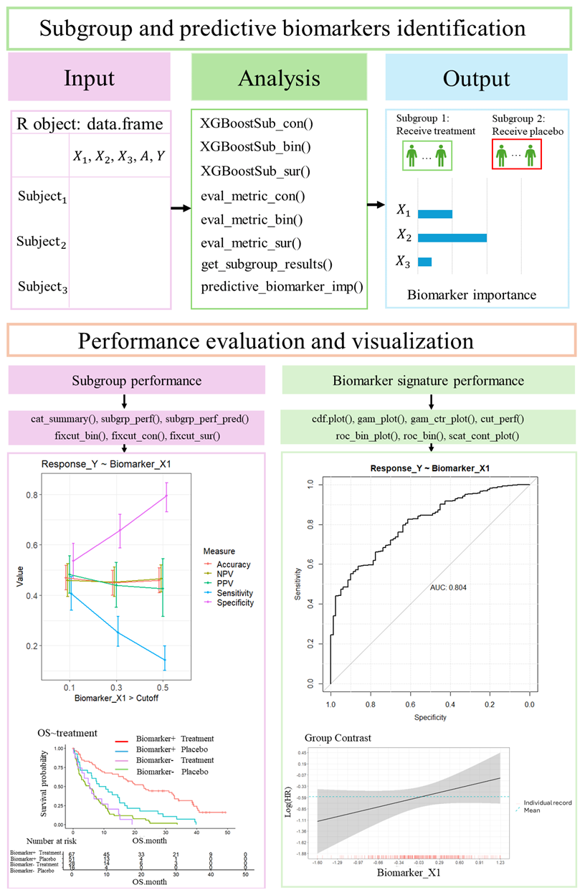

# BioPred

The R package BioPred offers a suite of tools for subgroup and biomarker analysis in precision medicine. Leveraging Extreme Gradient Boosting (XGBoost) along with propensity score weighting and A-learning methods, BioPred facilitates the optimization of individualized treatment rules (ITR) to streamline sub-group identification. BioPred also enables the identification of predictive biomarkers and obtaining their importance rankings. Moreover, the package provides graphical plots tailored for biomarker analysis. This tool enables clinical researchers seeking to enhance their understanding of biomarkers and patient popula-tion in drug development. 
## Installation

You can install the `BioPred` package from GitHub using the `devtools` package. If you don't have `devtools` installed, you can install it using:

```r
install.packages("devtools")
devtools::install_github("deeplearner0731/BioPred")
```
You can also install `BioPred` package from CRAN

```r
install.packages("BioPred")
```

## Main Functions

- `XGBoostSub_con()`: Function for Training XGBoost Model with Customized Loss Function (A-loss and Weight-loss) for continuous outcomes.
- `XGBoostSub_bin()`: Function for Training XGBoost Model with Customized Loss Function (A-loss and Weight-loss) for binary outcomes.
- `XGBoostSub_sur()`: Function for Training XGBoost Model with Customized Loss Function (A-loss and Weight-loss) for time-to-event outcomes.
- `eval_metric_con() `: Function for Evaluating XGBoostSub_con Model Performance.
- `eval_metric_bin() `: Function for Evaluating XGBoostSub_bin Model Performance.
- `eval_metric_sur() `: Function for Evaluating XGBoostSub_sur Model Performance.
- `predictive_biomarker_imp() `: This function calculates and plots the importance of biomarkers in a trained XGBoostSub_con, XGBoostSub_bin or XGBoostSub_sur model.
- `get_subgroup_results() `: This function predicts the treatment assignment for each patient based on a cutoff value.
- `cdf_plot() `: Cumulative Distribution Function (CDF) plot for a biomarker.
- `roc_bin() `: AUC ROC Table for Biomarkers Associated with Binary Outcomes.
- `roc_bin_plot() `: Generates ROC plots for different biomarkers associated with binary outcomes.
- `scat_cont_plot() `: Scatter Plot for a Biomarker Associated with Continuous Outcome.
- `gam_plot() `: Generates a generalized additive model (GAM) plot for exploring the relationship between a response variable and a biomarker.
- `gam_ctr_plot() `: Computes and plots the contrasts between treatment and control group based on a GAM for exploring the relationship between treatment benefit and biomarker.
- `fixcut_con() `:This function conducts fixed cutoff analysis for individual biomarker associated with continuous outcome variables.
- `fixcut_bin() `: This function conducts fixed cutoff analysis for individual biomarker associated with binary outcome variables.
- `fixcut_sur() `: This function conducts fixed cutoff analysis for individual biomarker associated with time-to-event  outcome variables.
- `cut_perf() `: This function evaluates the performance of a predictive model at a selected cutoff point.
- `cat_summary() `: This function provides a summary of categorical biomarkers in a dataset.
- `subgrp_perf_pred() `: This function evaluates the performance of subgroups based on different types of response variables in predictive cases.
- `subgrp_perf() `: This function evaluates subgroup performance based on different types of response variables.
## Dependencies

The `BioPred` package depends on the following R packages:

- `pROC`
- `ggplot2`
- `PropCIs`
- `xgboost`
- `pROC`
- `survival`
- `mgcv`
- `survminer`
- `onewaytests`
- `car`
  
Make sure to install these packages before using `BioPred`.

## Workflow



This plot illustrates an example of analysis and visualization tools using the BioPred R package. “Biomarker +” denotes the biomarker-positive subpopulation, where the biomarker value meets the cutoff or other criteria, while “Biomarker –” signifies the biomarker-negative subpopulation, where the biomarker value does not meet the respective criteria.

## Author

This package is maintained by Zihuan Liu, Yan Sun, and Xin Huang. For any queries or issues, please contact us at:

- Zihuan Liu: <zihuan.liu@abbvie.com>
- Yan Sun: <yan.sun@abbvie.com>
- Xin Huang: <xin.huang@abbvie.com>

## License
This package is licensed under the GPL-3 License.

## Contributing
Contributions are welcome! Please fork the repository and submit a pull request with your changes. Make sure to follow the coding guidelines and document your code appropriately.

## Acknowledgments
Special thanks to all contributors and the open-source community for their invaluable support.

